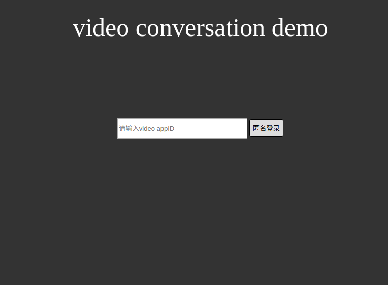

## 1. 下载 Javascript 快速入门

下载 Javascript 快速入门。[下载](https://github.com/WildDogTeam/video-quickstart-javascript/archive/master.zip)

## 2. 创建应用

在 Wilddog [控制面板](https://www.wilddog.com/dashboard/) 中创建一个新应用或使用已有应用。 [如何创建应用？](https://docs.wilddog.com/console/creat.html)

## 3. 开启匿名登录认证方式

应用创建成功后，进入“管理应用-->身份认证-->登录方式”。开启匿名登录。


## 4. 开启 Video 服务
进入 “管理应用-->实时视频通话”，打开实时视频功能。
## 5. 启动本地 Web 服务

启动本地 Web 服务，建立 https 环境。快速入门中采用 Node.js 搭建本地服务，用户也可以使用其他方式启动本地 Web 服务。使用 Node.js 开启本地 Web 服务：

```javascript
node https_channel_server.js
```
## 6. 在浏览器中打开快速入门页面

本地 Web 服务启动后，访问 [https://127.0.0.1:8080](https://127.0.0.1:8080) 就可以看到快速入门页面。



输入video AppID


## 7. 建立会话
如果用户列表为空，打开同一浏览器隐身窗口（Chrome 快捷键 "Ctrl+Shift+N"; Firefox 快捷键 "Ctrl+Shift+P")并再次访问[https://127.0.0.1:8080](https://127.0.0.1:8080)，输入同一应用 ID 并登录，然后邀请列表中的用户，会话建立成功。

## 8. 相关链接

[完整文档](https://docs.wilddog.com/conversation/Web/guide/core.html)


